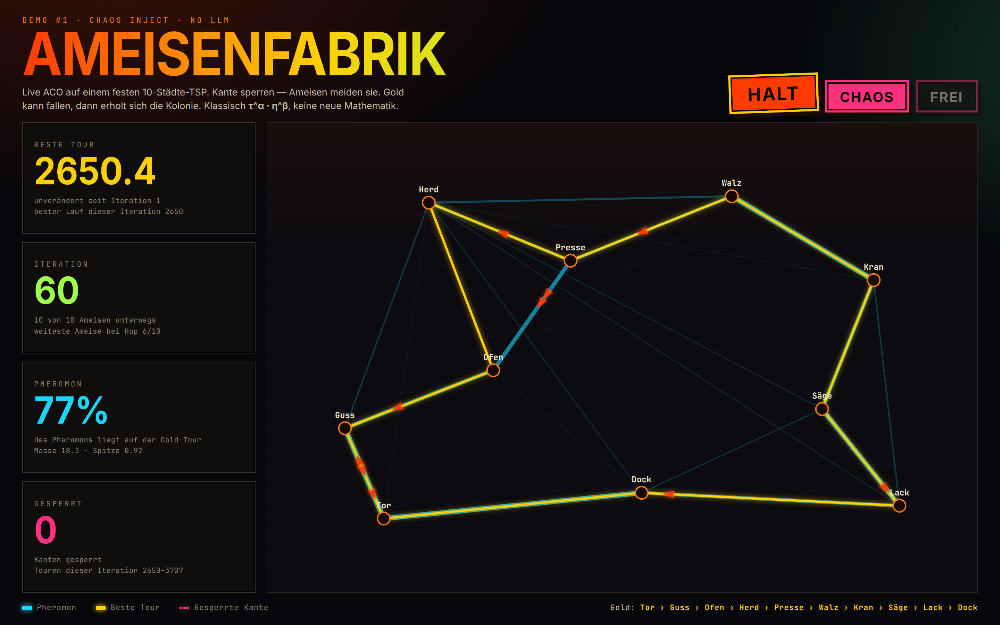
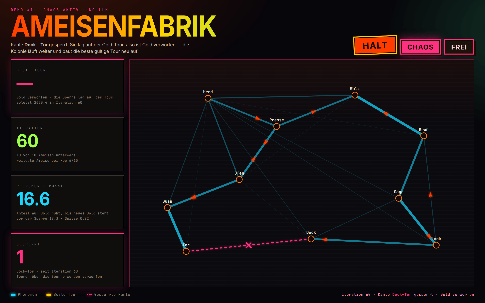
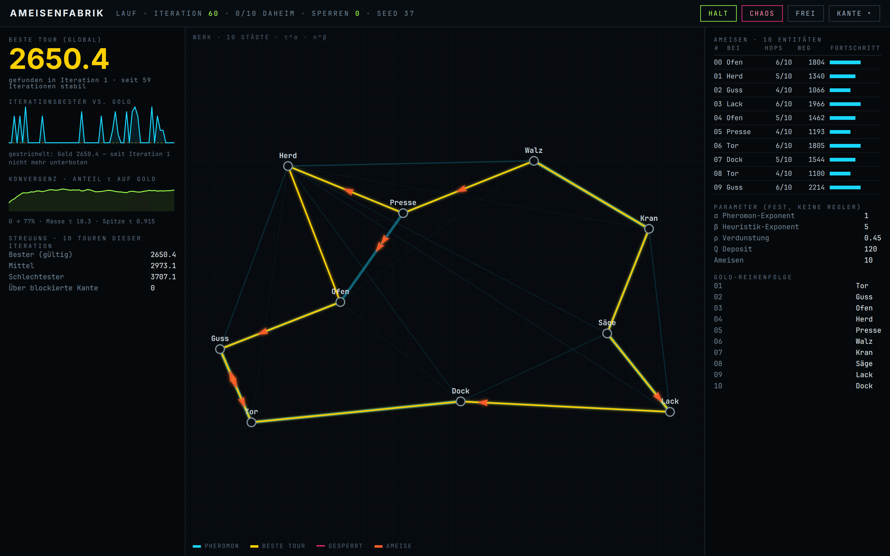
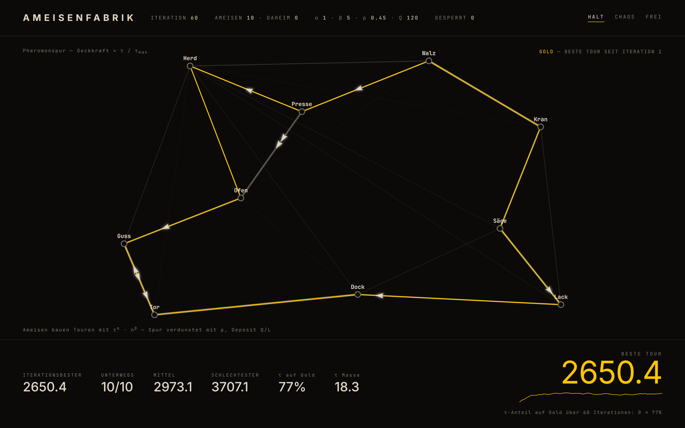
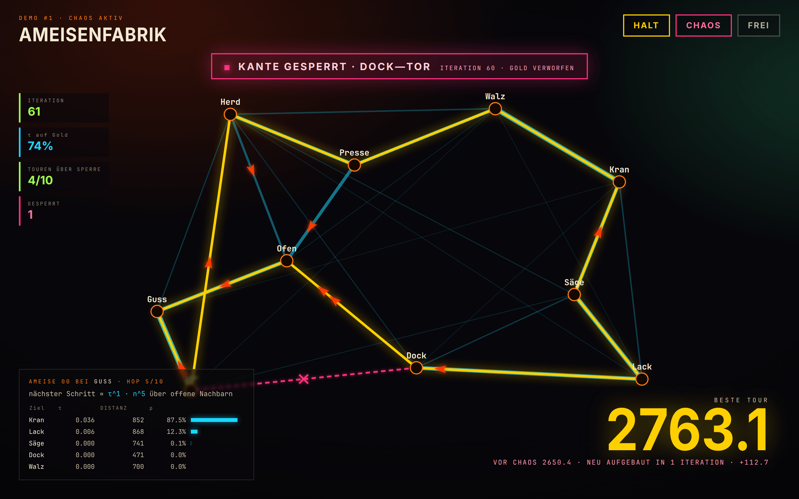

# Ameisenfabrik UI — design samples

Visual directions explored for `/ameisen`. **None of this is shipped code** — these are frozen
renders from the design study, kept as the record of what was considered.

> **Picked: A — Werkstatt.** B, C and D stay below as the record of what was rejected. The design
> language and layout for A are in `docs/AMEISENFABRIK-UI.md` §6–§7, and that is what shipped.

## How these were made

Every number, tour, trail and ant position is **real sim state**, not a drawing: the colony was run with the
code as it stood at the time (`lib/ameisen`, seed 37, defaults α 1, β 5, ρ 0.45, Q 120, τ₀ 1, 10 ants, and a
**10-city** fixture) and the resulting snapshot rendered into the HTML in this folder, screenshotted at
1440×900 @2x. Open any `.html` in a browser to see it full size.

The live fixture was later reduced to **5 cities** for the 3D walk graph, so these frames no longer match
what `/ameisen` draws today. They are kept for their layout and information design, which is what was being
decided, not as a picture of the current page.

Two caveats: the render box has no Impact, so display type falls back to Inter 800 — read the samples for
layout, hierarchy and information design, not for the exact typeface; and most frames show a calm colony at
iteration 60, while the chaos frames show what happens around blocking **Dock—Tor**, the edge
`pickChaosEdge` selects.

---

## A — Werkstatt · picked

**Mood:** today’s factory-enamel identity, reorganised. Big gradient wordmark, rotated Halt plate, signage plates.

**Emphasis:** one hero — best tour length, with the age of that record underneath — then iteration + colony
progress, τ-on-gold share, blocked count. The gold city chain runs along the footer.

**Tradeoff:** the left rail costs ~336 px of stage width, and four bordered plates are still a lot of chrome
for four numbers. Lowest-risk change from what exists today.

### A2 — the Chaos moment in the same language

Werkstatt has no room for D’s event banner, so this frame checks that the rail can carry an event on its
own. It is the instant **Dock—Tor** is blocked, before the next iteration closes: the blocked edge lay on
the gold tour, so gold is discarded and **there is no gold path on the canvas at all**.

What the layout does with that: plate 1 goes `—` in magenta behind an alert border and says why; plate 3
falls back from “τ-Anteil auf Gold” to plain pheromone mass, because the share has no referent while there
is no gold — and the mass itself drops 18.3 → 16.6, since blocking an edge zeroes its trail; plate 4 names
the edge; the footer swaps the gold chain for the event line; **Frei** wakes up. One iteration later gold
comes back at 2763.1 (+112.7) and everything returns to the normal column.

That is the design question A2 answers: **yes**, the rail plus the footer slot can punctuate an event
without a banner floating over the stage.

---

## B — Leitstand · not picked

**Mood:** control room. Monospace, hairline rules, a thin status strip instead of a poster header.

**Emphasis:** everything measurable. Iteration-best plotted against the flat gold baseline (the spiky cyan
series is the colony actually searching), τ-on-gold convergence, the spread of the ten tours, a live ant
roster with hop progress, and the fixed parameters spelled out.

**Tradeoff:** this is an instrument, not theater — from 4 m most of the right column is unreadable, and the
header no longer says “Ameisenfabrik” loudly. Best if the demo is narrated to engineers.

---

## C — Blaupause · not picked

**Mood:** printed plate. Bone-on-black, near monochrome, gold is the only saturated colour on screen.

**Emphasis:** the graph itself. No boxes at all: facts sit on hairline rules at the top, a measurement row
across the bottom, and annotations are placed next to what they describe. The hero number is set light and
large rather than loud.

**Tradeoff:** highest data-ink, lowest spectacle. The pheromone field loses its cyan (it becomes intensity
only), and a Chaos event has to fight for attention in a design built to stay calm.

---

## D — Bühne · not picked

**Mood:** stage. Full-bleed canvas, vignette, everything floats over the graph.

**Emphasis:** the event and the mechanism. A banner names the blocked edge, the giant gold number shows the
rebuilt tour with what it cost (`vor Chaos 2650.4 · neu aufgebaut in 1 Iteration · +112.7`), and the panel
bottom-left shows one ant’s actual next-step decision: τ, distance and the resulting probability per
candidate. In this frame ant 00 at Guss takes the 852-long hop to Kran at 87.5 % because the trail is dead
everywhere else — that is ACO explaining itself.

**Tradeoff:** overlays sit on the graph and need scrims to stay readable; the decision panel is a lot of
detail in a design that otherwise shouts. Most work of the four to get right, biggest payoff in a room.
